# 📊 Forecasting Analysis 플로우 차트

## 전체 프로세스 개요

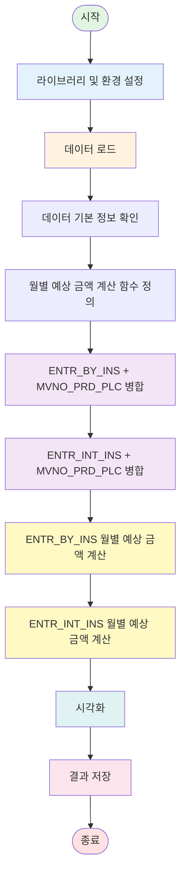

---

## 1️⃣ 초기화 단계

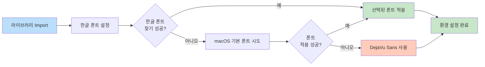

### 사용 라이브러리
- `pandas` - 데이터 처리
- `numpy` - 수치 계산
- `matplotlib` - 시각화
- `seaborn` - 통계 시각화
- `datetime`, `dateutil.relativedelta` - 날짜 계산

---

## 2️⃣ 데이터 로드 단계

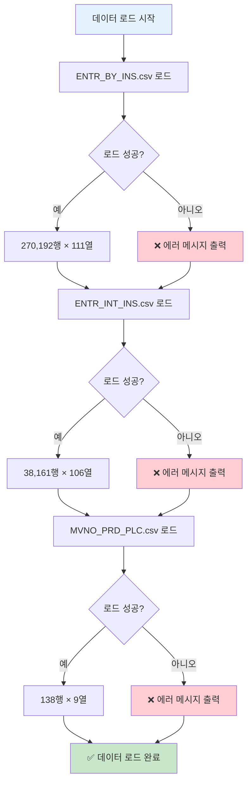

### 데이터 파일 정보
| 파일명 | 인코딩 | 행 수 | 열 수 | 설명 |
|--------|--------|-------|-------|------|
| ENTR_BY_INS.csv | cp949 | 270,192 | 111 | M-2 정산내역 |
| ENTR_INT_INS.csv | utf-8 | 38,161 | 106 | M-1 신규 가입자 |
| MVNO_PRD_PLC.csv | utf-8 | 138 | 9 | 요금제 정보 |

---

## 3️⃣ 데이터 병합 단계

### ENTR_BY_INS 병합 프로세스

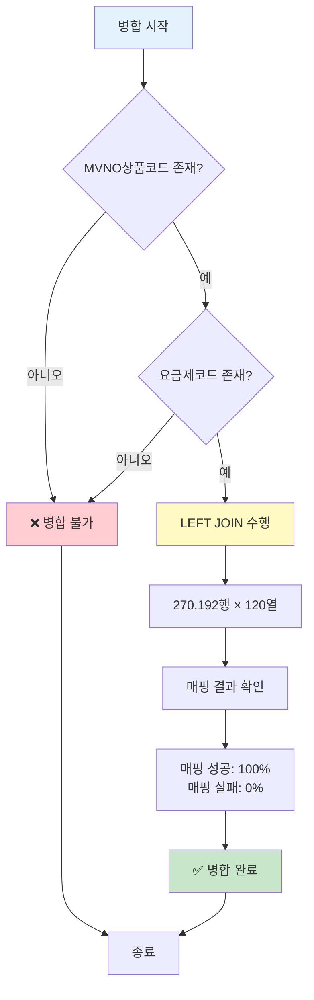

### ENTR_INT_INS 병합 프로세스

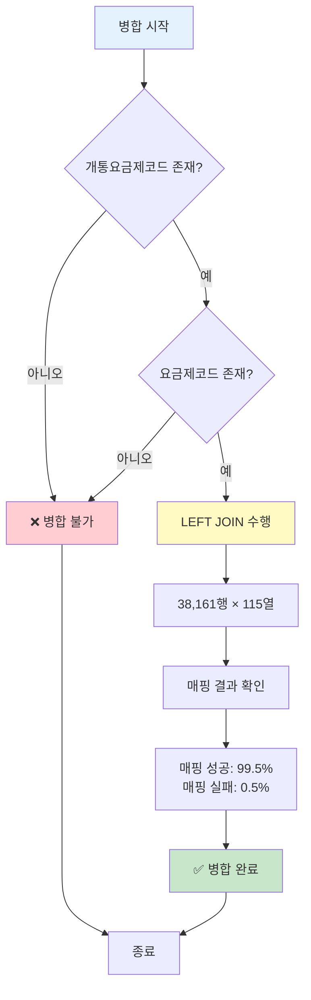

### 병합 키 매핑

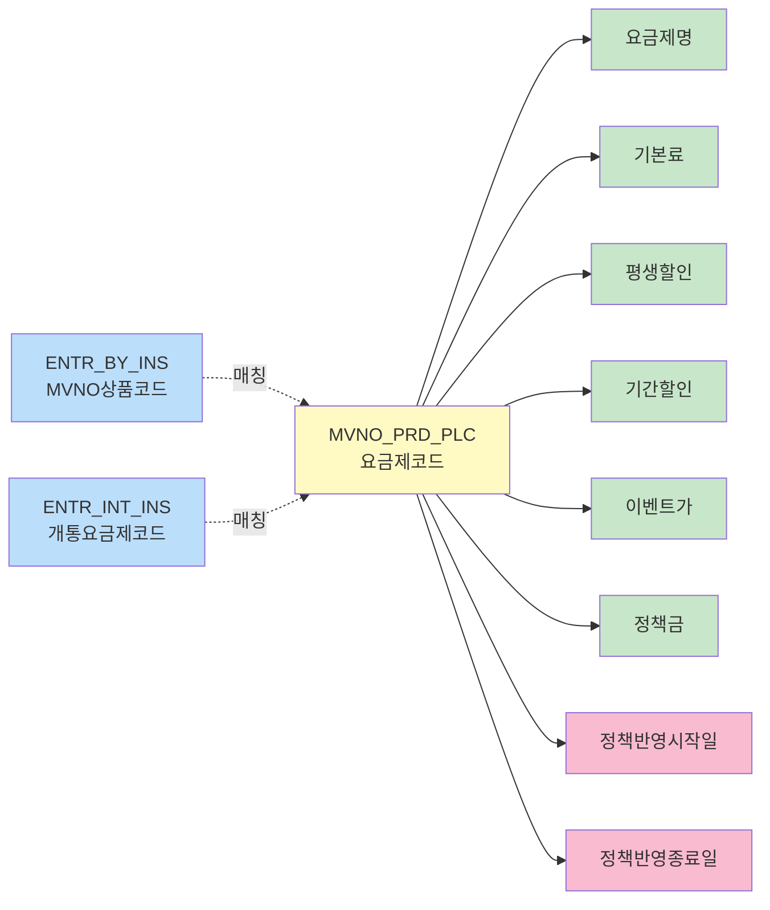

---

## 4️⃣ 월별 예상 금액 계산 함수

### 함수 로직 플로우

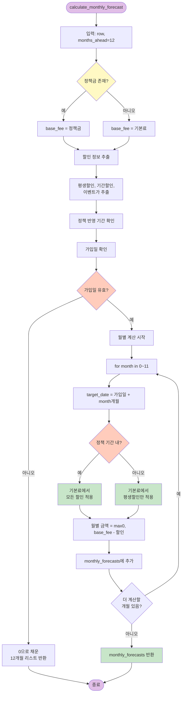

### 할인 적용 로직 상세

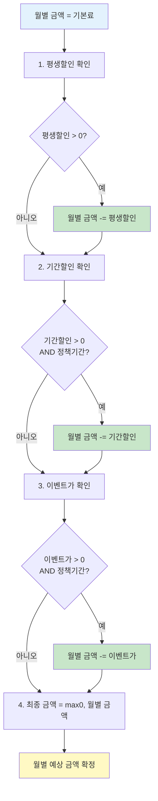

---

## 5️⃣ 예상 금액 계산 실행

### ENTR_BY_INS 계산 프로세스


### ENTR_INT_INS 계산 프로세스

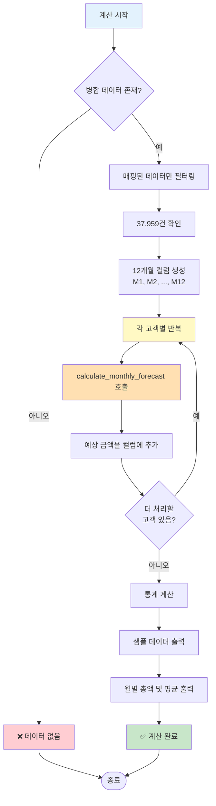

---

## 6️⃣ 시각화 프로세스

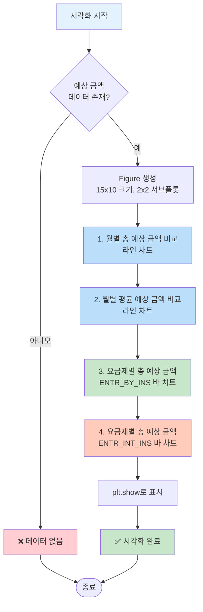

### 시각화 구성

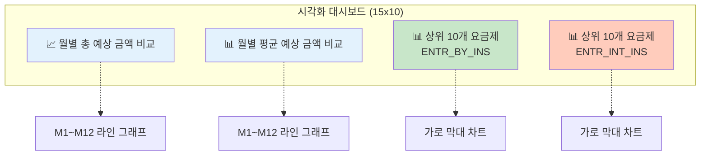

---

## 7️⃣ 결과 저장 프로세스

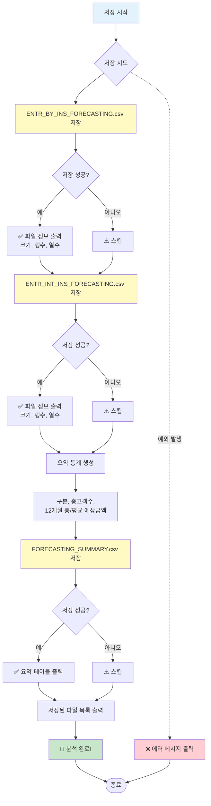

### 출력 파일 구조

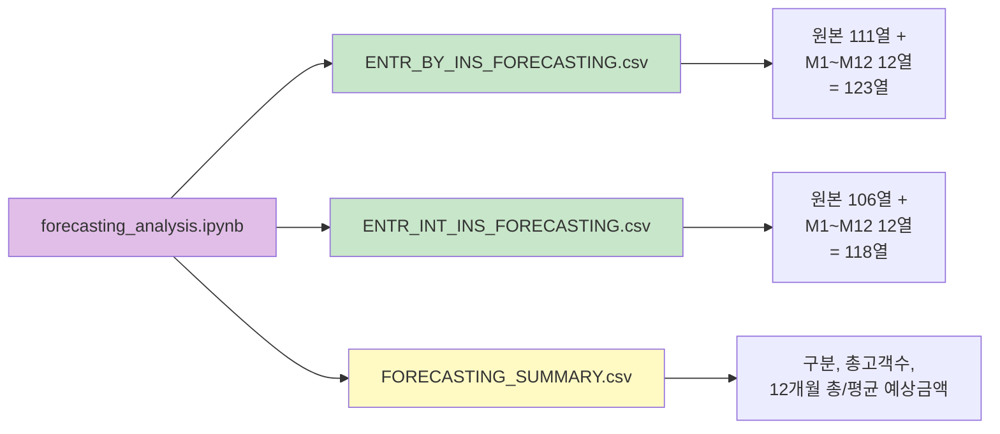

---

## 8️⃣ 전체 데이터 흐름도

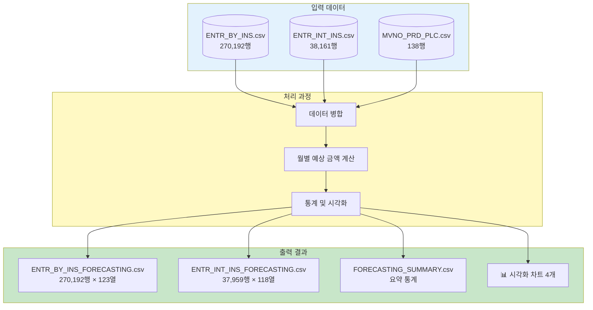

---

## 9️⃣ 핵심 계산 로직 요약

### 월별 예상 금액 계산 공식

```
월별_예상_금액 = MAX(0, 기본_금액 - 총_할인액)

where:
  기본_금액 = 정책금 (존재시) OR 기본료 (기본값)
  
  총_할인액 = 평생할인 + 기간할인(정책기간내) + 이벤트가(정책기간내)
  
  정책기간 = 정책반영시작일 <= 대상월 <= 정책반영종료일
```

### 시간 계산 로직

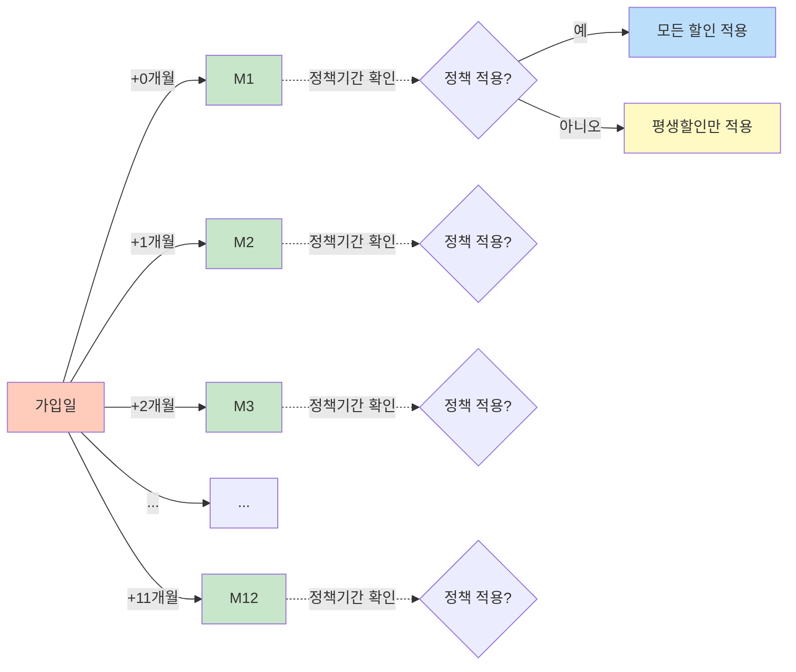

---

## 🔟 예외 처리 흐름

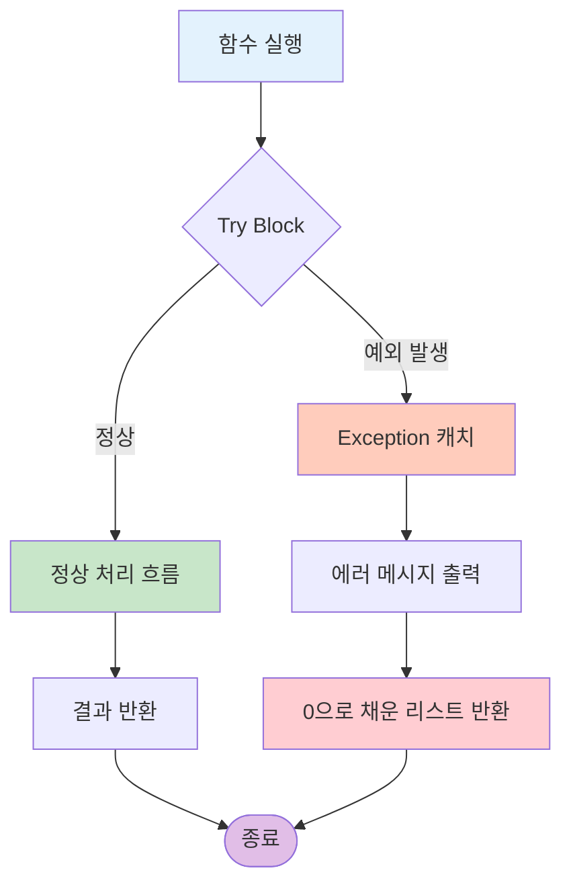

---

## 📊 성능 및 규모

### 처리 규모

| 구분 | ENTR_BY_INS | ENTR_INT_INS |
|------|-------------|--------------|
| **입력 행수** | 270,192 | 38,161 |
| **입력 열수** | 111 | 106 |
| **병합 후 열수** | 120 | 115 |
| **예상 금액 열 추가** | +12 (M1~M12) | +12 (M1~M12) |
| **최종 열수** | 132 | 127 |
| **매핑 성공률** | 100.0% | 99.5% |
| **처리 대상** | 270,192건 | 37,959건 |

### 계산 복잡도

```
총 계산 횟수 = (ENTR_BY_INS 고객수 + ENTR_INT_INS 고객수) × 12개월
             = (270,192 + 37,959) × 12
             = 3,697,812번의 월별 금액 계산
```

---

## 📝 주요 특징

### ✅ 장점
1. **동적 정책 반영**: 정책 기간에 따라 자동으로 할인 적용
2. **가입일 기준 계산**: 각 고객의 실제 가입일을 기준으로 예측
3. **유연한 할인 로직**: 평생할인, 기간할인, 이벤트가를 구분하여 적용
4. **완전한 데이터 보존**: 원본 데이터에 예상 금액 컬럼만 추가
5. **시각화 제공**: 4가지 차트로 다각도 분석

### ⚠️ 주의사항
1. **가입일 필수**: 가입일이 없는 데이터는 예상 금액이 0으로 처리
2. **정책 기간 검증**: 정책반영시작일/종료일이 유효하지 않으면 할인 미적용
3. **음수 방지**: 최종 금액이 음수가 되지 않도록 `max(0, amount)` 처리
4. **대용량 처리**: 30만+ 행 × 12개월 계산이므로 처리 시간 소요

---

## 🎯 활용 방안

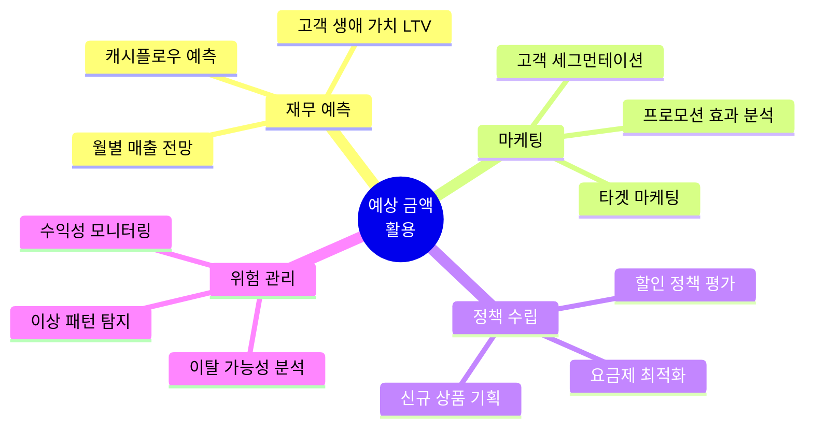

---

## 📌 결론

이 플로우 차트는 `forecasting_analysis.ipynb`의 전체 프로세스를 시각화한 것으로, 다음과 같은 핵심 단계를 포함합니다:

1. **데이터 준비**: 3개 CSV 파일 로드 및 병합
2. **계산 로직**: 정책 기간과 할인을 고려한 월별 예상 금액 산정
3. **결과 생성**: 12개월 예상 금액이 추가된 CSV 파일 생성
4. **분석 및 시각화**: 4가지 차트로 다각도 분석 제공

이를 통해 MVNO 사업자는 가입 고객의 향후 12개월간 예상 매출을 정확히 예측하고, 데이터 기반 의사결정을 할 수 있습니다.

